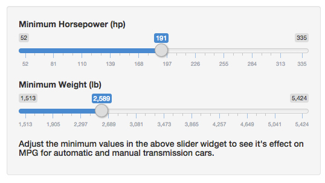

## Adjustable Histogram Plotting App

<ul>
  <li>You can use the real app <b><a href="https://mrttackfrog.shinyapps.io/DevelopingDataProductsAssingment/" target="_blank">here</a></b></li>
  <li>You can view the github source for the app <b><a href="https://github.com/gfreedman/DevelopingDataProductsAssingment" target="_blank">here</a></b></li>
  <li></li>
</ul>


--- .class #id 

## Overview of R plot

<ul>
  <li>You can see that initially it looks like manual transmission cars have a higher MPG than automatic ones...</li>
  <li>But maybe weight and horsepower offer a better explanation into these MPG differences?
</ul>

```{r, echo=FALSE,message=F, warning=F, fig.height=5, fig.width=14}
library(ggplot2)
data(mtcars)
mtcars$am <- as.factor(mtcars$am)
levels(mtcars$am) <- c("Automatic", "Manual")
sumMtcars <- aggregate(mpg~am, data = mtcars, function(x) mean(x))
ggplot(mtcars, aes(x=mpg, fill=am)) + geom_histogram(binwidth=1, alpha=.5, position="identity") + geom_vline(data=sumMtcars, aes(xintercept=mpg, colour=am), linetype="dashed", size=1)
```

--- .class #id 

## But what happens to MPG when we increase hp?

<ul>
  <li>When we set our minimum horsepower to <b>219</b>, the advantage quickly narrows...</li>
  </li>
</ul>


```{r, echo=FALSE,message=F, warning=F, fig.height=5, fig.width=14}
data(mtcars)
mtcars$am <- as.factor(mtcars$am)
levels(mtcars$am) <- c("Automatic", "Manual")
mtcars <- subset(mtcars, hp >= 219)
sumMtcars <- aggregate(mpg~am, data = mtcars, function(x) mean(x))
ggplot(mtcars, aes(x=mpg, fill=am)) + geom_histogram(binwidth=1, alpha=.5, position="identity") + geom_vline(data=sumMtcars, aes(xintercept=mpg, colour=am), linetype="dashed", size=1)
```

--- .class #id 


## What happens when we start increasing weight?

<ul>
  <li>Give it a <b><a href="https://mrttackfrog.shinyapps.io/DevelopingDataProductsAssingment/" target="_blank">try</a></b> yourself!</li>
  <li>Start using the UI slider widget below and see what happens to the difference in MPG when you play with the slider!
  <li></li>
</ul>
